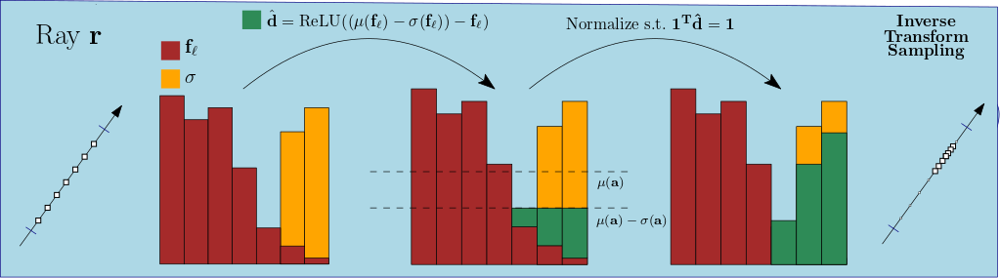

# Analyzing the Internals of Neural Radiance Fields
### [Lukas Radl](https://scholar.google.com/citations?user=G_0ZsTIAAAAJ&hl=de)<sup>&ddagger;</sup>, [Andreas Kurz](https://online.tugraz.at/tug_online/visitenkarte.show_vcard?pPersonenGruppe=3&pPersonenId=D715516087483BD3)<sup>&ddagger;</sup>,[Markus Steinberger](https://www.markussteinberger.net/)<sup>&ddagger;</sup><br>
#### <sup>&ddagger;</sup> Graz University of Technology <br>
#### [Project Page](nerfinternals.github.io) | [Preprint](https://arxiv.org/pdf/2306.00696.pdf)

We propose a novel method to extract densities from intermediate activations. Using our approach, we can skip the forward 
pass of the coarse NeRF, in turn gaining efficiency. We find that this approach also works when using Mip-NeRF and even holds
for proposal network samples, as in Mip-NeRF 360.

# Installation
This repository follows the integration guidelines described [here](https://docs.nerf.studio/en/latest/developer_guides/new_methods.html) for custom methods within Nerfstudio. 
### 0. Install Nerfstudio dependencies
[Follow these instructions](https://docs.nerf.studio/en/latest/quickstart/installation.html) to install Nerfstudio.
### 1. Clone our repo
Navigate to the `nerfstudio` directory and run
`
git clone https://github.com/r4dl/nerfinternals.git
`<br>
The folder structure should now look like the following:
```
nerfstudio
├── ...
├── nerfinternals
│   ├── nerfinternals
│   ├── outputs
│   ├── scripts
│   ├── pyproject.toml
│   └── README.md
├── nerfstudio
│   ├── data
│   │   ├── blender
│   │   │   ├── chair
│   │   │   └── ...
│   │   ├── nerf_llff_data
│   │   │   ├── fern
│   │   │   └── ...
│   │   └── ...
│   └── ...
└── ...
```
Note that the `nerfstudio/outputs` directory is not created by default, but will be created if you train models.
### 2. Install as a python package
Navigate to the `nerfstudio/nerfinternals` folder and run`python -m pip install -e .`

### 3. Run `ns-install-cli`
Note: You should re-activate your environment.
### 4. Run `ns-train -h` to verify the installation
You should see a list of subcommands containing...
```console
╭─ subcommands ────────────────────────────────────────────────────────╮
│ activation-mipnerf    Using Activations to infer Depth, Mip-NeRF.    │
│ activation-nerf       Using Activations to infer Depth, NeRF.        │
│ activation-nerfacto   Using Activations to infer Depth, nerfacto.    │
│ ...                                                                  │
╰──────────────────────────────────────────────────────────────────────╯ 
```
You should see the new methods `activation-{nerf, mipnerf, nerfacto}`

## Training
To train a model (just as done in the paper), run:
```train
ns-train activation-{nerf, mipnerf, nerfacto} --data <path_to_data> <other cl-args> <dataparser>
```
### Scripts
As we need to set a lot of individual command line arguments, we provide scripts in the `nerfinternals/scripts/` 
directory to train models for all scenes of a dataset. <br>
We provide a helper for each script, you can use `./launch_train_{blender, llff}_{nerf, nerfacto, nerfacto_NDC}.sh -h`.<br>
Note that we used the configuration in `launch_train_llff_nerfacto.sh` for our results in the main paper. <br>
For this, we used the `nerfstudio_data` dataparser, hence we need to use `ns-process-data` to convert the LLFF dataset to the required format.
Run `ns-process-data -h` for further information about this command. We use the default arguments for `images`, and we use 
the images with a downscale factor of 4.

## Evaluation
To evaluate with **our approach**, use our `eval.py` script located in `nerfinternals/nerfinternals/eval.py`. <br>
Our models expect data in the directory `nerfstudio/data/{nerf_llff_data, blender}`. <br>
Example data can be downloaded with `ns-download-data`. We use the LLFF dataset provided by [NeRF-Factory](https://github.com/kakaobrain/nerf-factory).<br>
Run `python nerfinternals/nerfinternals/eval.py -h` to see a list of available options:
```console
usage: eval.py [-h] --load-config PATH [--layer INT [INT ...]]
               [--fct INT [INT ...]] [--upsample | --no-upsample]
               [--run-normal | --no-run-normal] [--output-dir STR]

Load a checkpoint, use the activations for estimating the density.

╭─ arguments ────────────────────────────────────────────────────────────────╮
│ -h, --help              show this help message and exit                    │
│ --load-config PATH      Path to config YAML file. (required)               │
│ --layer INT [INT ...]   layer in which to observe the activations - must   │
│                         not be larger than num_layers (default: 0 1 2)     │
│ --fct INT [INT ...]     function to use - must not be larger than 2        │
│                         (default: 0 1 2)                                   │
│ --upsample, --no-upsample                                                  │
│                         whether to upsample or not (default: False)        │
│ --run-normal, --no-run-normal                                              │
│                         whether to run coarse-to-fine pipeline or not      │
│                         (default: True)                                    │
│ --output-dir STR        directory to save outputs in (default: eval)       │
╰────────────────────────────────────────────────────────────────────────────╯
```
As an example command, running from the `nerfstudio/nerfinternals` directory, you can use
```
python3 nerfinternals/eval.py --load-config outputs/chair/activation-nerf/2023-04-28_135527/config.yml --layer 0 --fct 0 --no-run-normal
```
which produces the following images (left NeRF, right **Ours**).<br>

<br>
Statistics are given in the the stats.json file (run on a NVIDIA 2070 Super):
```json
  "base": {
    "t": 43.97965955734253,
    "metrics": {
      "psnr": 35.70448684692383,
      "ssim": 0.9865843057632446,
      "lpips": 0.020251736044883728
    }
  },
  "layer_00_ups_0_fct_std": {
    "t": 33.18729019165039,
    "metrics": {
      "psnr": 34.74652099609375,
      "ssim": 0.9822013974189758,
      "lpips": 0.03017939068377018,
      "quantitative": {
        "t_act": 1.0785419940948486,
        "t_coarse": 0.0,
        "t_fine": 32.10867691040039
      }
    }
  }
```

## Pre-trained Models
As models are costly to train, especially for NeRF and Mip-NeRF, we provide pre-trained models in [outputs.zip](https://drive.google.com/file/d/1whGVEQ-LvpsgYZGxQvOA5tYcJ8N_sc-9/view?usp=sharing), hosted via Google Drive. <br>
Note that these models can be used with `{vanilla-nerf, mipnerf}` by re-writing the corresponding `config.yml` file. <br>
Create a directory `nerfinternals/outputs` and paste the models there. <br>

## Results
Our approach achieves the following performance on:
<table>
<tr><th>
<a href="https://paperswithcode.com/sota/novel-view-synthesis-on-nerf">Blender Dataset</a></th>
<th>
<a href="https://paperswithcode.com/sota/novel-view-synthesis-on-llff">LLFF Dataset</a></th>
</tr>
<tr><td>

| Model name                   | PSNR     |
|------------------------------|----------|
| NeRF (best)                  | 29.44 dB |
| Mip-NeRF (best)              | 29.35 dB |
| nerfacto (best)              | 26.56 dB |

</td><td>

| Model name                   | PSNR     |
|------------------------------|----------|
| NeRF (best)                  | 25.40 dB |
| Mip-NeRF (best)              | 25.49 dB |
| nerfacto (best)              | 24.85 dB |

</td></tr> </table>

# Acknowledgements
This project is built on [Nerfstudio](https://docs.nerf.studio/en/latest/)<br>
[](https://docs.nerf.studio/en/latest/)<br>
Our code was tested with [nerfstudio=v0.3.1](https://github.com/nerfstudio-project/nerfstudio/releases/tag/v0.3.1) 
and Cuda 11.7.

If you use our work or build on top of it, use the following citation:
```bibtex
@article(Radl2023NerfInternals,
  title     = {{Analyzing the Internals of Neural Radiance Fields}},
  author    = {Radl, Lukas and Kurz, Andreas and Steinberger, Markus},
  journal   = {arXiv preprint arXiv:2306.00696},
  year      = {2023},
}
```