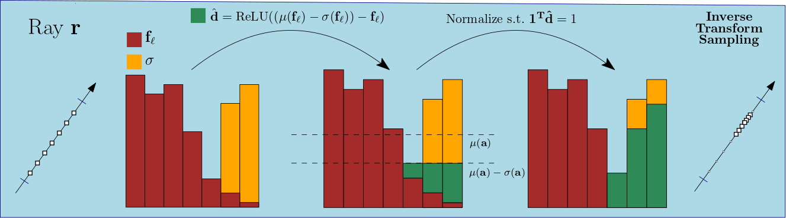

# Analyzing the Internals of Neural Radiance Fields
### [Lukas Radl](https://scholar.google.com/citations?user=G_0ZsTIAAAAJ&hl=de)<sup>1</sup>, [Andreas Kurz](https://online.tugraz.at/tug_online/visitenkarte.show_vcard?pPersonenGruppe=3&pPersonenId=D715516087483BD3)<sup>1</sup>,[Markus Steinberger](https://www.markussteinberger.net/)<sup>1</sup><br>
#### <sup>1</sup> Graz University of Technology <br>
#### [Project Page]() | [Preprint]()
<br>
# Installation
This repository follows the integration guidelines described [here](https://docs.nerf.studio/en/latest/developer_guides/new_methods.html) for custom methods within Nerfstudio. 
### 0. Install Nerfstudio dependencies
[Follow these instructions](https://docs.nerf.studio/en/latest/quickstart/installation.html) to install Nerfstudio.
### 1. Paste this directory into nerfstudio
The folder structure should look like this:
```
nerfstudio
├── ...
├── nerfinternals
│   ├── nerfinternals
│   ├── outputs
│   ├── scripts
│   ├── pyproject.toml
│   └── README.md
├── nerfstudio
│   ├── data
│   │   ├── blender
│   │   │   ├── chair
│   │   │   └── ...
│   │   ├── nerf_llff_data
│   │   │   ├── fern
│   │   │   └── ...
│   │   └── ...
│   └── ...
└── ...
```
### 2. Install as a python package
Navigate to the `nerfstudio/nerfinternals` folder and run`python -m pip install -e .`

### 3. Run `ns-install-cli`
Note: You should re-activate your environment.
### 4. Run `ns-train -h`
```console
╭─ subcommands ────────────────────────────────────────────────────────╮
│ activation-mipnerf    Using Activations to infer Depth, Mip-NeRF.    │
│ activation-nerf       Using Activations to infer Depth, NeRF.        │
│ activation-nerfacto   Using Activations to infer Depth, nerfacto.    │
│ ...                                                                  │
╰──────────────────────────────────────────────────────────────────────╯ 
```
You should see the new methods `activation_{nerf, mipnerf, nerfacto}`
## Running pre-trained Methods
As models are costly to train, we provide pre-trained models in ... <br>
Create a directory `nerfinternals/outputs` and paste the models there.
To evaluate, use our `eval.py` script located in `nerfinternals/nerfinternals/eval.py`. <br>
Our models expect data in the directory `nerfstudio/data/{nerf_llff_data, blender}`. <br>
Example data can be downloaded with `ns-download-data`. We use the LLFF dataset provided by [NeRF-Factory](https://github.com/kakaobrain/nerf-factory).<br>
Run `python nerfinternals/nerfinternals/eval.py -h` to see a list of available options:
```console
usage: eval.py [-h] --load-config PATH [--layer INT [INT ...]]
               [--fct INT [INT ...]] [--upsample | --no-upsample]
               [--run-normal | --no-run-normal] [--output-dir STR]

Load a checkpoint, use the activations for estimating the density.

╭─ arguments ────────────────────────────────────────────────────────────────╮
│ -h, --help              show this help message and exit                    │
│ --load-config PATH      Path to config YAML file. (required)               │
│ --layer INT [INT ...]   layer in which to observe the activations - must   │
│                         not be larger than num_layers (default: 0 1 2)     │
│ --fct INT [INT ...]     function to use - must not be larger than 2        │
│                         (default: 0 1 2)                                   │
│ --upsample, --no-upsample                                                  │
│                         whether to upsample or not (default: False)        │
│ --run-normal, --no-run-normal                                              │
│                         whether to upsample or not (default: True)         │
│ --output-dir STR        directory to save outputs in (default: eval)       │
╰────────────────────────────────────────────────────────────────────────────╯
```
As an example command, running from the nerfinternals directory, you can use
```
python3 nerfinternals/eval.py --load-config outputs/chair/activation-nerf/2023-04-28_135527/config.yml --layer 0 --fct 0 --no-run-normal
```
which produces the following images (left NeRF, right **Ours**).<br>

<br>
Statistics are given in the the stats.json file (run on a NVIDIA 2070 Super):
```json
  "base": {
    "t": 43.97965955734253,
    "metrics": {
      "psnr": 35.70448684692383,
      "ssim": 0.9865843057632446,
      "lpips": 0.020251736044883728
    }
  },
  "layer_00_ups_0_fct_std": {
    "t": 33.18729019165039,
    "metrics": {
      "psnr": 34.74652099609375,
      "ssim": 0.9822013974189758,
      "lpips": 0.03017939068377018,
      "quantitative": {
        "t_act": 1.0785419940948486,
        "t_coarse": 0.0,
        "t_fine": 32.10867691040039
      }
    }
  }
```
## Scripts
We provide scripts in the `nerfinternals/scripts/` directory to train models for all scenes of a dataset. <br>
Note that we used the configuration in `launch_train_llff_nerfacto.sh` for our results in the main paper. <br>
For this, we used the **nerfstudio_data** dataparser, hence we need to use `ns-process-data` to convert the LLFF dataset to the required format.


This project is built on [NerfStudio](https://docs.nerf.studio/en/latest/)<br>
[](https://docs.nerf.studio/en/latest/)<br>
Our code was tested with [nerfstudio=v0.3.1](https://github.com/nerfstudio-project/nerfstudio/releases/tag/v0.3.1) 
and Cuda 11.7.

If you use our work or build on top of it, use the following citation:
```bibtex
@article(RadlNerfInternals2023,
  title     = {{Analyzing the Internals of Neural Radiance Fields}},
  author    = {Radl, Lukas and Kurz, Andreas and Steinberger, Markus},
  journal   = {arXiv preprint arXiv:},
  year      = {2023},
}
```